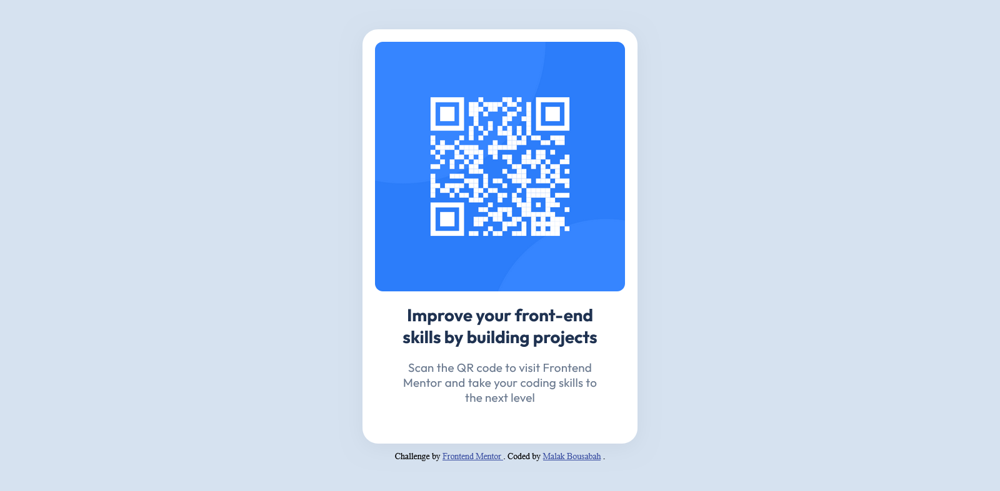

# Frontend Mentor - QR code component solution

This is a solution to the [QR code component challenge on Frontend Mentor](https://www.frontendmentor.io/challenges/qr-code-component-iux_sIO_H). Frontend Mentor challenges help you improve your coding skills by building realistic projects. 

## Table of contents

- [Overview](#overview)
  - [Screenshot](#screenshot)
  - [Links](#links)
- [My process](#my-process)
  - [Built with](#built-with)
  - [What I learned](#what-i-learned)
  - [Continued development](#continued-development)
  - [Useful resources](#useful-resources)
- [Author](#author)

## Overview

### Screenshot



### Links

- Solution URL: https://www.frontendmentor.io/solutions/qr-code-component-responsive-S2qxelxj6l
- Live Site URL: https://qr-code-component-nine-dusky.vercel.app/

## My process

### Built with

- Semantic HTML5 markup
- CSS custom properties
- Flexbox

### What I learned

I learned to use the font by using it from websites instead of downloading it in my project.

```css
@import url('https://fonts.googleapis.com/css2?family=Outfit:wght@100..900&display=swap');
```
### Continued development

I want to improve my skills in writing clean and concise code. I also want to learn how to work with Figma design files more quickly and easily.

### Useful resources

- [A complete guide to submitting solutions on Frontend Mentor](https://medium.com/frontend-mentor/a-complete-guide-to-submitting-solutions-on-frontend-mentor-ac6384162248#id_token=eyJhbGciOiJSUzI1NiIsImtpZCI6ImZhMDcyZjc1Nzg0NjQyNjE1MDg3YzcxODJjMTAxMzQxZTE4ZjdhM2EiLCJ0eXAiOiJKV1QifQ.eyJpc3MiOiJodHRwczovL2FjY291bnRzLmdvb2dsZS5jb20iLCJhenAiOiIyMTYyOTYwMzU4MzQtazFrNnFlMDYwczJ0cDJhMmphbTRsamRjbXMwMHN0dGcuYXBwcy5nb29nbGV1c2VyY29udGVudC5jb20iLCJhdWQiOiIyMTYyOTYwMzU4MzQtazFrNnFlMDYwczJ0cDJhMmphbTRsamRjbXMwMHN0dGcuYXBwcy5nb29nbGV1c2VyY29udGVudC5jb20iLCJzdWIiOiIxMDk3OTMyNTU1MTE4MDg4OTY5MzUiLCJlbWFpbCI6Im1hbGFrLndvcmxkd2lkZUBnbWFpbC5jb20iLCJlbWFpbF92ZXJpZmllZCI6dHJ1ZSwibmJmIjoxNzM4NTYxOTU2LCJuYW1lIjoi2YXZhNin2YMg2LnYqNivINin2YTZhNmHIiwicGljdHVyZSI6Imh0dHBzOi8vbGgzLmdvb2dsZXVzZXJjb250ZW50LmNvbS9hL0FDZzhvY0pkQ2FlU0dJZkgxN3NuQ1lvUF92MjZnWmRIX21hQk5iRlFjcnBlWk90Q3ppYkM3dERYPXM5Ni1jIiwiZ2l2ZW5fbmFtZSI6ItmF2YTYp9mDIiwiZmFtaWx5X25hbWUiOiLYudio2K8g2KfZhNmE2YciLCJpYXQiOjE3Mzg1NjIyNTYsImV4cCI6MTczODU2NTg1NiwianRpIjoiMmIwMzVjODI2MWUwMjI3MDlhNjkzZTc5Y2RmZDI0ZmZiZTFkYTVmNiJ9.ZyU55KWPtcDMDRUd3uHrsrHYOiKnO8XjmT1q79m0ih3qPSavx5fV4OsYwnMwcRLKPl66UaEvvWChqOpfmEtTKtNf4HIi0c0fNMtEeuDVThlQIMWg_41-T9JK6EfXVpIe3WkF_B04nOTnEX83Brm7NdBud2HA4A12O58qPfVNcGCP-7GbaJMAiB2Rhhc8IJLeKWnLlOGeBCP9EdxUESkrelmE8khCjD6LSB4WyeHyCfXld-pJCznCyc9_zitj5PRNzPUfEOOYimcny3ub6P9HK6Qe2DpQK-ztFAHt06oNKz8zbDhnUK1FhuBFR9ztfMtUwVy2NTDTo4-maq3JhRSeEw) - This helped me for submitting solutions on Frontend Mentor
- [Figma for developers: How to work with a design file](https://www.frontendmentor.io/articles/figma-for-developers-how-to-work-with-a-design-file-m6CZKZ1rC1) - This is an amazing article which helped me How to work with a design file.

## Author

- Frontend Mentor - [@malakworldwide](https://www.frontendmentor.io/profile/malakworldwide)

